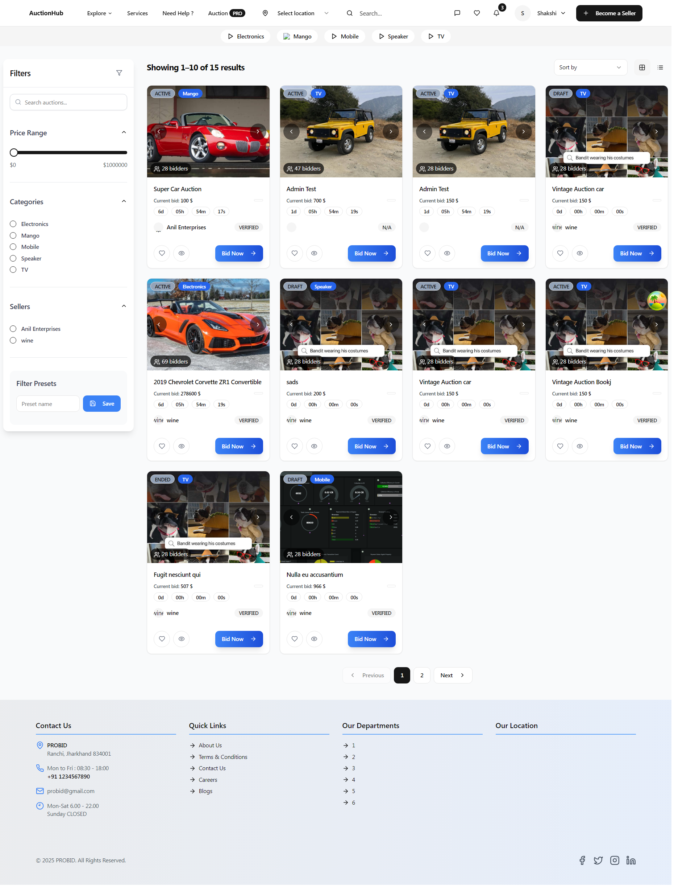
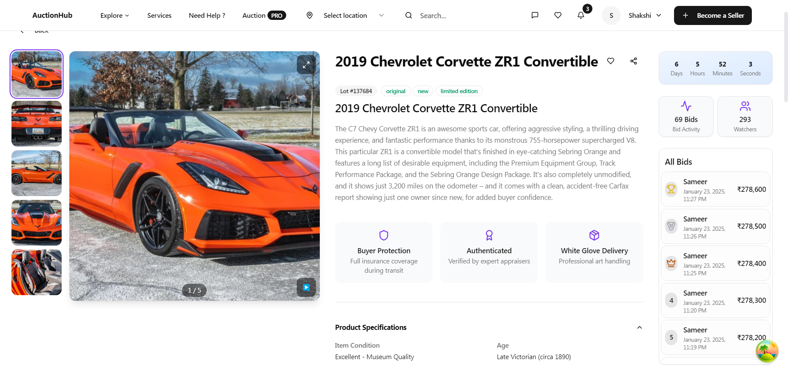
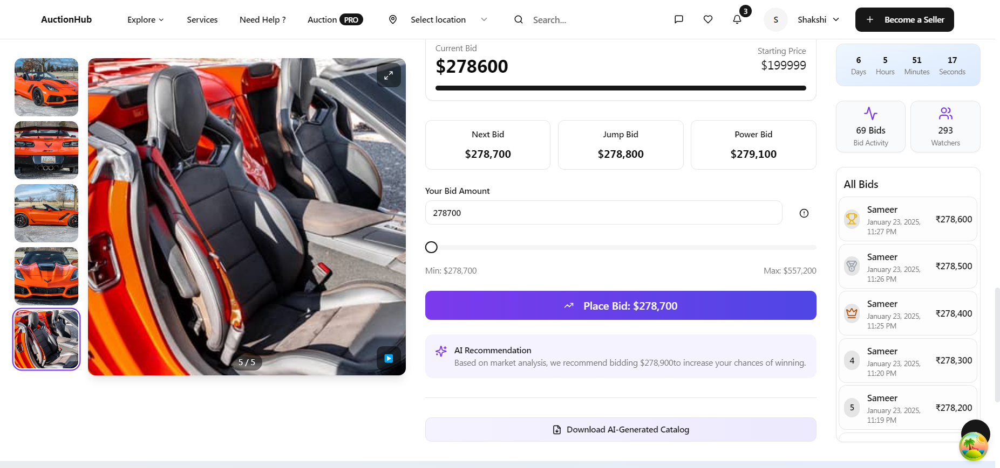
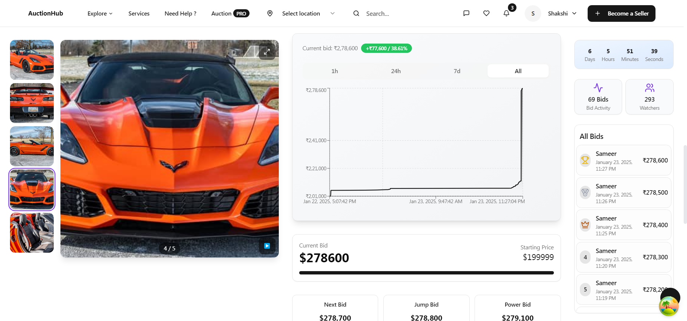
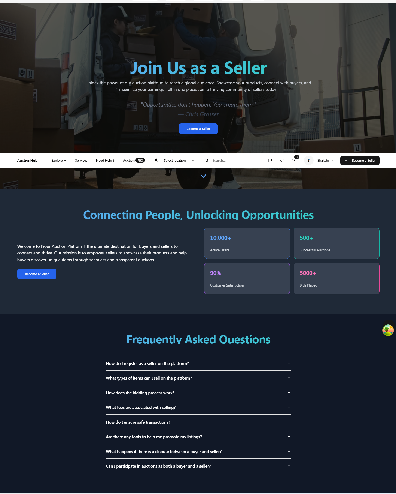

# Advanced Auction Bidding Platform

An innovative platform redefining the online auction experience, combining hybrid auction models, AI-driven analytics, and robust security to deliver unparalleled performance. This repository provides the full-stack implementation, development guidelines, and roadmap for our revolutionary bidding ecosystem.

---

## **Platform Overview**

### **Core Features**
#### User Features:
- **Streamlined Onboarding:** Secure registration with two-factor authentication (2FA).  
- **Intuitive Browsing:** Explore auctions by category, price, and popularity with advanced filtering.  
- **Real-Time Bidding:** Participate in auctions with live updates and seamless notifications.  

#### Seller Features:
- **Customizable Auctions:** Create auctions with formats like reserve price, "buy-now," and time-limited options.  
- **Performance Analytics:** Monitor trends, insights, and revenue using AI-based tools.  
- **Inventory Management:** Automate scheduling and promotions for optimized visibility.
- **Advanced Dashboard:** Manage Auctions, Customers, make notifications, auction personilize, and more....  

#### Admin Features:
- **Platform Oversight:** Manage users, auctions, and disputes with a comprehensive dashboard.  
- **Fraud Detection:** AI-driven anomaly detection to safeguard platform integrity.  
- **Dynamic Reporting:** Generate insights into revenue, activity, and trends.
- **Advanced Dashboard:** Manage Auctions, Customers, Sellers, Reports, Complaints  make notifications, auction personilize, and more....  
---

## **Screenshots**
### Homepage


### Auction Page






### Seller Page


---

## **Technology Stack**

| Component           | Technology                               |
|---------------------|------------------------------------------|
| **Frontend**        | Next.js, Tailwind CSS, ShadCN            |
| **Backend**         | Node.js, Express.js, Prisma, Socket      |
| **Database**        | PostgresSQL, Redis                       |
| **AI/Analytics**    | BullMQ (TensorFlow, analytics)           |
| **Authentication**  | JWT, OAuth 2.0, 2FA, Google, Facebook    |

---

## **How to Get Started**

### Prerequisites
- **Node.js**: Version 16.x or higher.
- **PostgresSQL**: Version 8.0 or higher.


### Installation
1. Clone the repository:
   ```bash
   git clone https://github.com/yourusername/Advanced-Hybrid-Auction-Bidding-Platform.git


### 💖 Support This Project